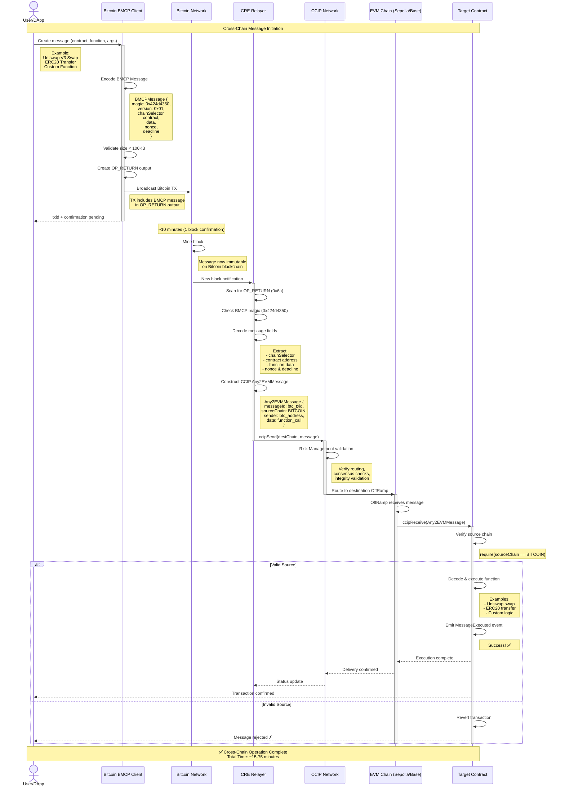

# BMCP - Bitcoin Multichain Protocol

**Bitcoin to EVM Cross-Chain Messaging via Chainlink CCIP**

[](https://opensource.org/licenses/MIT)
[](https://www.typescriptlang.org/)
[](https://soliditylang.org/)

## Overview

BMCP (Bitcoin Multichain Protocol) enables **cross-chain messaging from Bitcoin** to EVM chains using **Chainlink CCIP** and the revolutionary **100KB OP_RETURN** capacity in Bitcoin Core v30.0.

### Key Features

✅ **100KB OP_RETURN**: Store complete CCIP messages on-chain (no external storage needed)  
✅ **Single Bitcoin TX**: One transaction triggers cross-chain operations  
✅ **Standard CCIP**: Works with existing Chainlink infrastructure  
✅ **Trustless**: Bitcoin provides immutable message ordering  
✅ **Complex Operations**: Support for batch DeFi operations, multi-step transactions  
✅ **Future Lightning Integration**: Designed for Lightning → Bitcoin → EVM flows  

## Architecture

```
┌─────────────┐      ┌──────────────┐      ┌──────────────┐      ┌─────────────┐
│   User/DApp │─────▶│   Bitcoin    │─────▶│ CRE Relayer  │─────▶│ CCIP Network│
│             │      │ CCIP Client  │      │              │      │             │
└─────────────┘      └──────────────┘      └──────────────┘      └─────────────┘
                            │                      │                      │
                            ▼                      ▼                      ▼
                     ┌──────────────┐      ┌──────────────┐      ┌─────────────┐
                     │   Bitcoin    │      │   Bitcoin    │      │  Base Chain │
                     │   Network    │      │   Blocks     │      │             │
                     │  (100KB OP_  │      │   Scanner    │      │  Receiver   │
                     │   RETURN)    │      │              │      │  Contract   │
                     └──────────────┘      └──────────────┘      └─────────────┘
```

## Complete Message Flow

### Sequence Diagram



### Phase-by-Phase Breakdown

#### Phase 1: Message Construction (< 1 second)
- User initiates via Bitcoin BMCP Client or Dashboard
- Client encodes BMCP message with target chain and function
- Message validated to fit within 100KB limit
- Complete message embedded in Bitcoin OP_RETURN

#### Phase 2: Bitcoin Settlement (~10-60 minutes)
- Transaction broadcast to Bitcoin network
- Block mined and confirmed (1-6 confirmations)
- Message permanently committed on Bitcoin blockchain

#### Phase 3: Relayer Detection (~30 seconds)
- CRE relayer monitors new Bitcoin blocks
- Scans for OP_RETURN outputs
- Filters for BMCP magic: `0x424d4350`
- Extracts and decodes complete message

#### Phase 4: CCIP Routing (2-5 minutes)
- Message validated by Risk Management Network
- Routed through CCIP network to destination chain
- Delivered to destination OffRamp contract

#### Phase 5: Execution (~2 seconds)
- Destination contract receives via `ccipReceive()`
- Verifies Bitcoin as valid source chain
- Decodes and executes embedded function call
- Emits confirmation event

**Total Time**: ~15-75 minutes (depends on Bitcoin confirmations)

## Protocol Encoding

BMCP uses a compact binary encoding optimized for Bitcoin OP_RETURN:

### Message Structure

The BMCP protocol uses a binary format optimized for Bitcoin OP_RETURN:

```
┌──────────────────────────────────────────────────────────────────┐
│                      BMCP Message Layout                          │
├────────┬────────┬───────────────────────────────────────────────┤
│ Offset │  Size  │           Field Description                   │
├────────┼────────┼───────────────────────────────────────────────┤
│ 0x00   │ 4 byte │ Protocol Magic: 0x424d4350 ("BMCP")          │
│ 0x04   │ 1 byte │ Version: 0x01                                 │
│ 0x05   │ 8 byte │ Chain Selector (uint64 big-endian)           │
│ 0x0D   │ 20 byte│ Contract Address (EVM address)                │
│ 0x21   │ 4 byte │ Data Length (uint32 big-endian)              │
│ 0x25   │ N byte │ Data (ABI-encoded function call)              │
│ N+0x25 │ 4 byte │ Nonce (uint32 big-endian, optional)          │
│ N+0x29 │ 4 byte │ Deadline (uint32 unix timestamp, optional)    │
└────────┴────────┴───────────────────────────────────────────────┘

Total Size: 33 + N + optional fields
Maximum: ~99,900 bytes (Bitcoin OP_RETURN limit)
```

### Protocol Identifier Breakdown

```
Protocol Magic: 0x424d4350 = "BMCP" in ASCII
              ┌──────┬──────┬──────┬──────┐
              │ 0x42 │ 0x4d │ 0x43 │ 0x50 │
              │  'B' │  'M' │  'C' │  'P' │
              └──────┴──────┴──────┴──────┘
```

**Detection Flow:**
1. Check for OP_RETURN (`0x6a`)
2. Check for BMCP magic: `0x424d4350` (4 bytes)
3. Validate version and decode message

**Why 0x424d4350?**
- **Clear Identity**: "BMCP" = Bitcoin Multichain Protocol
- **Unique**: Not used by other Bitcoin protocols
- **Memorable**: Spells out the protocol name
- **Filterable**: Easy for relayers to detect in OP_RETURN data

### Supported Chain Selectors

| Chain | Selector (Decimal) | Selector (Hex) | Network |
|-------|-------------------|----------------|---------|
| Base | `15971525489660198786` | `0xDD8E5C1C8E6E0E12` | Mainnet |
| Base Sepolia | `10344971235874465080` | `0x8F6B85F9F8AB8B38` | Testnet |
| Ethereum | `5009297550715157269` | `0x4586C3B60A9A1B95` | Mainnet |
| Arbitrum | `4949039107694359620` | `0x44B0C700C2E38E44` | Mainnet |
| Optimism | `3734403246176062136` | `0x33D9B8A5F8C1E338` | Mainnet |
| **Polygon** | **`4051577828743386545`** | **`0x3841B13A019CAEE1`** | **Mainnet** ✅ |
| Polygon Amoy | `16281711391670634445` | `0xE200F72C6D5684AD` | Testnet |
| Citrea | `0x4349545245410000` | `0x4349545245410000` | Custom |
| Citrea Testnet | `0x4349545245415400` | `0x4349545245415400` | Custom |

### Example: Real BMCP Message

Here's a real example from the dashboard:

```
0x424d435001de41ba4fc9d91ad92bae8224110482ec6ddf12faf359a35362d435730064f21355f40000000000000000000000000000000000000000000000000000000000000020000000000000000000000000000000000000000000000000000000000000001f48656c6c6f2066726f6d20426974636f696e202d20313a30343a313020616d0000000000692295ca
```

**Decoded Breakdown:**

| Field | Hex | Decoded Value |
|-------|-----|---------------|
| **Protocol Magic** | `424d4350` | "BMCP" (ASCII) |
| **Version** | `01` | 1 |
| **Chain Selector** | `de41ba4fc9d91ad9` | Custom chain (16006838950662912473) |
| **Contract** | `2bae8224110482ec6ddf12faf359a35362d43573` | 0x2bae82...d43573 |
| **Data Length** | `00000064` | 100 bytes |
| **Data** | `f21355f4...` | ABI-encoded `onReport(string)` |
| **Nonce** | `00000000` | 0 |
| **Deadline** | `692295ca` | 1763874250 (timestamp) |

**Function Call Decoded:**
```typescript
// Function: onReport(string message)
// Message: "Hello from Bitcoin - 1:04:10 am"
```

### Example: Transfer Function

```typescript
// Encoding a transfer function call
const encoded = BitcoinCommandEncoder.encodeBinary(
  CHAIN_SELECTORS.BASE_SEPOLIA,
  '0x742d35Cc6634C0532925a3b844Bc9e7595f0bEb',
  {
    signature: 'transfer(address,uint256)',
    args: ['0x742d35Cc6634C0532925a3b844Bc9e7595f0bEb', '10000000000000000000']
  },
  {
    nonce: 0,
    deadline: Math.floor(Date.now() / 1000) + 3600
  }
);

// Result (example):
// 0x424d4350  // Protocol: "BMCP"
//   01        // Version: 1
//   8f6b85f9f8ab8b38  // Chain: Base Sepolia
//   742d35cc6634c0532925a3b844bc9e7595f0beb  // Contract
//   00000044  // Data length: 68 bytes
//   a9059cbb  // Function selector: transfer
//   000000000000000000000000742d35cc6634c0532925a3b844bc9e7595f0beb
//   0000000000000000000000000000000000000000000000008ac7230489e80000
//   00000000  // Nonce: 0
//   <timestamp>  // Deadline
```

## 🚀 Deployed Contracts

### Citrea Testnet (Schnorr Verification)

| Contract | Address | Chain ID | Explorer |
|----------|---------|----------|----------|
| **BMCPMessageReceiver** | `0xDeD3f4058Ccdf3C05Bc7f7c38cb07E66A6023893` | 5115 | [View Contract](https://explorer.testnet.citrea.xyz/address/0xDeD3f4058Ccdf3C05Bc7f7c38cb07E66A6023893) |
| **ExampleTargetContract** | `0x2314dfD079C2b2cf2C3247fCd552d9d52Ac486De` | 5115 | [View Contract](https://explorer.testnet.citrea.xyz/address/0x2314dfD079C2b2cf2C3247fCd552d9d52Ac486De) |
| **SchnorrVerifyCaller** | `0x54AAc9DE386C8185Fe8842456E55d7bF17b1f8aB` | 5115 | [View Contract](https://explorer.testnet.citrea.xyz/address/0x54AAc9DE386C8185Fe8842456E55d7bF17b1f8aB) |

### Base Sepolia (CCIP Integration)

| Contract | Address | Chain ID | Status |
|----------|---------|----------|--------|
| **BMCPCREReceiver** | TBD | 84532 | 🚧 Pending Deployment |
| **ExampleDeFiTarget** | TBD | 84532 | 🚧 Pending Deployment |

### Polygon Mainnet (CRE + CCIP Integration)

| Contract | Address | Chain ID | Explorer |
|----------|---------|----------|----------|
| **BMCPCREReceiver** | `0x103F53787b29ddf2B34ae185C13b7a6aE7445a8d` | 137 | [View Contract](https://polygonscan.com/address/0x103F53787b29ddf2B34ae185C13b7a6aE7445a8d) |
| **Uniswap V3 Router** | `0xE592427A0AEce92De3Edee1F18E0157C05861564` | 137 | [View Contract](https://polygonscan.com/address/0xE592427A0AEce92De3Edee1F18E0157C05861564) |
| **Uniswap V3 Factory** | `0x1F98431c8aD98523631AE4a59f267346ea31F984` | 137 | [View Contract](https://polygonscan.com/address/0x1F98431c8aD98523631AE4a59f267346ea31F984) |

**Features**:
- ✅ CRE Relayer integration
- ✅ CCIP message receiving
- ✅ Uniswap V3 swap execution
- ✅ ERC20 token transfers
- 📸 Transaction screenshots available (CRE-triggered operations)

### Deployment Transaction Links

#### Citrea Testnet Deployments

| Contract | Transaction Hash | Status | Gas Used |
|----------|------------------|--------|----------|
| ExampleTargetContract | [`0x9a8e0a9e...54ad9`](https://explorer.testnet.citrea.xyz/tx/0x9a8e0a9ee302a8e25c8b44a2dca9b5d428d90fea8365f2780bf31f44e7654ad9) | ✅ Success | 929,460 |
| BMCPMessageReceiver | [`0x3e231e37...05d7`](https://explorer.testnet.citrea.xyz/tx/0x3e231e37f88236b2ab1a58ac483c1e9637662e1dba635d7691b477c40a1d05d7) | ✅ Success | 947,465 |
| Initial Token Mint | [`0x540f6e4e...ad20`](https://explorer.testnet.citrea.xyz/tx/0x540f6e4ef556b80d9d1ce383ae8341158a0ec20c297f35efbf2bf617244bad20) | ✅ Success | 46,234 |

### Real-World Transaction Examples

#### Polygon Mainnet (CRE-Triggered)

| Type | Contract | Transaction Hash | Operation | Status |
|------|----------|------------------|-----------|--------|
| **Uniswap V3 Swap** | `0x103F53787b29ddf2B34ae185C13b7a6aE7445a8d` | 📸 Screenshots Available | Swap via CRE | ✅ Success |
| **CCIP Message** | `0x103F53787b29ddf2B34ae185C13b7a6aE7445a8d` | 📸 Screenshots Available | Cross-chain receive | ✅ Success |
| **Token Operations** | Various | 📸 Screenshots Available | ERC20 interactions | ✅ Success |

> **Note**: Transaction hashes and detailed screenshots will be added from CRE relayer operations

#### Ethereum Sepolia Testnet

| Type | Contract | Transaction Hash | Operation | Status |
|------|----------|------------------|-----------|--------|
| **Uniswap V3 Swap** | `0xEc648D63d002150bD2A72cB197b37F28357E1e65` | [`0x672297cc...054b`](https://sepolia.etherscan.io/tx/0x672297ccdd3720da61a145be286aa17b828d719b34d1aed00b3326df41f6054b) | UniswapV3 interaction | ✅ Success |
| **ERC20 Transfer** | Various | [`0xb4c257af...fcb5`](https://sepolia.etherscan.io/tx/0xb4c257afe91e2686849caa8f5cf602e45a9ce25fb848c7519275ea831bb9fcb5/advanced#internal) | Internal transfer | ✅ Success |
| **Native Transfer** | N/A | [View TX](https://sepolia.etherscan.io/tx/0xb4c257afe91e2686849caa8f5cf602e45a9ce25fb848c7519275ea831bb9fcb5) | ETH transfer | ✅ Success |

#### Example BMCP Encoded Message

**Dashboard-Generated Message:**
```
0x424d435001de41ba4fc9d91ad92bae8224110482ec6ddf12faf359a35362d435730064f21355f40000000000000000000000000000000000000000000000000000000000000020000000000000000000000000000000000000000000000000000000000000001f48656c6c6f2066726f6d20426974636f696e202d20313a30343a313020616d0000000000692295ca
```

**Decoded:**
- Protocol: `BMCP` (0x424d4350)
- Version: `1`
- Chain: Custom (0xde41ba4fc9d91ad9)
- Contract: `0x2bae8224110482ec6ddf12faf359a35362d43573`
- Function: `onReport("Hello from Bitcoin - 1:04:10 am")`
- Nonce: `0`
- Deadline: `1763874250` (May 2025)

### Integration Screenshots

<details>
<summary>📸 Click to view integration screenshots</summary>

#### Dashboard Message Encoding

*Dashboard interface for creating BMCP messages*

#### Bitcoin Transaction with OP_RETURN

*Bitcoin transaction containing BMCP message in OP_RETURN*

---

### Polygon Mainnet - CRE Triggered Operations

#### CRE Receiver Contract Execution

*BMCPCREReceiver on Polygon Mainnet - Address: `0x103F53787b29ddf2B34ae185C13b7a6aE7445a8d`*

#### Uniswap V3 Swap on Polygon

*Uniswap V3 swap executed via CRE on Polygon Mainnet*

#### CCIP Message Receipt

*CCIP message received and executed on Polygon*

---

### Ethereum Sepolia - Test Operations

#### Ethereum Contract Execution

*Uniswap V3 swap triggered from Bitcoin - [View TX](https://sepolia.etherscan.io/tx/0x672297ccdd3720da61a145be286aa17b828d719b34d1aed00b3326df41f6054b)*

#### ERC20 Transfer Success

*ERC20 transfer executed via BMCP - [View TX](https://sepolia.etherscan.io/tx/0xb4c257afe91e2686849caa8f5cf602e45a9ce25fb848c7519275ea831bb9fcb5/advanced#internal)*

</details>

### Bitcoin Transaction Examples

> Will be populated with actual Bitcoin transactions once relayer is live

| Type | Bitcoin TX | Destination | EVM Operation | Status |
|------|-----------|-------------|---------------|--------|
| Uniswap Swap | TBD | Sepolia | Uniswap V3 swap | 🚧 Relayer Pending |
| Token Transfer | TBD | Sepolia | ERC20 transfer | 🚧 Relayer Pending |
| DeFi Batch | TBD | Base Sepolia | Multiple operations | 🚧 Relayer Pending |
| NFT Mint | TBD | Base Sepolia | ERC721 mint | 🚧 Relayer Pending |

📖 **Full Flow Documentation**: See [CCIP-CRE Flow](./docs/CCIP_CRE_FLOW.md) for detailed sequence diagrams and protocol encoding details.

## Monorepo Structure

BMCP is organized as a monorepo with the following packages:

```
BMCP/
├── packages/
│   ├── sdk/                        # @bmcp/sdk - Core protocol encoding
│   ├── bitcoin-api/                # Bitcoin RPC integration
│   ├── relayer-api/                # CRE Relayer HTTP API
│   ├── relayer/                    # CRE Relayer implementation
│   ├── contracts/                  # CCIP Receiver contracts (Solidity)
│   ├── zkevm-schnorr-contracts/    # Citrea Schnorr verification
│   ├── dashboard/                  # Web dashboard for testing
│   └── client/                     # Client library (coming soon)
├── examples/                       # Usage examples and demos
├── docs/                          # Documentation
│   ├── CCIP_CRE_FLOW.md          # Cross-chain flow diagrams
│   ├── PROTOCOL.md                # Protocol specification
│   └── ARCHITECTURE.md            # System architecture
└── tests/                         # Integration tests
    ├── integration/               # Cross-chain test suites
    └── utils/                     # Test utilities and scripts
```

## Installation

```bash
# Clone the repository
git clone https://github.com/yourusername/BMCP.git
cd BMCP

# Install all dependencies (uses npm workspaces)
npm install

# Copy environment template
cp .env.example .env

# Edit .env with your configuration
nano .env
```

## Configuration

Create a `.env` file with the following:

```env
# Bitcoin Node Configuration
BITCOIN_RPC_URL=http://localhost:8332
BITCOIN_RPC_USER=your_rpc_user
BITCOIN_RPC_PASSWORD=your_rpc_password
BITCOIN_NETWORK=testnet

# EVM Configuration
BASE_RPC_URL=https://mainnet.base.org
BASE_SEPOLIA_RPC_URL=https://sepolia.base.org
PRIVATE_KEY=your_private_key_here

# CCIP Configuration
CCIP_ROUTER_BASE=0x... # CCIP Router on Base
BITCOIN_CHAIN_SELECTOR=0x424954434f494e

# CRE Relayer Configuration
CRE_START_BLOCK=850000
CRE_CONFIRMATION_BLOCKS=6
CRE_POLL_INTERVAL_MS=30000
```

## Usage

### 1. Simple Cross-Chain Message

```typescript
import { BitcoinCCIPClient, CHAIN_SELECTORS } from '@bmcp/client';
import { ethers } from 'ethers';

// Initialize client
const client = new BitcoinCCIPClient({
  url: 'http://localhost:8332',
  user: 'bitcoin',
  password: 'password',
  network: 'testnet',
});

// Encode message data
const recipient = '0xYourAddress';
const amount = ethers.parseEther('0.1');
const messageData = BitcoinCCIPClient.encodeDepositMessage(recipient, amount);

// Send to Base chain
const receipt = await client.sendToBase(
  '0xReceiverContract', // Receiver contract on Base
  messageData,
  { gasLimit: 300_000 }
);

console.log('Transaction ID:', receipt.txid);
```

### 2. Batch DeFi Operations

```typescript
// Encode complex batch operation: Swap → Deposit → Borrow
const operations = {
  targets: ['0xUniswap', '0xAave', '0xCompound'],
  calls: [
    swapCalldata,    // Swap BTC to USDC
    depositCalldata, // Deposit USDC to Aave
    borrowCalldata,  // Borrow ETH from Compound
  ],
};

const batchData = ethers.AbiCoder.defaultAbiCoder().encode(
  ['bytes4', 'address[]', 'bytes[]'],
  [
    ethers.id('batchExecute(address[],bytes[])').slice(0, 10),
    operations.targets,
    operations.calls,
  ]
);

// All operations execute atomically on Base!
const receipt = await client.sendToBase(
  '0xDeFiGateway',
  batchData,
  { gasLimit: 1_000_000 }
);
```

### 3. Start CRE Relayer

```bash
# Build the project
npm run build

# Start the relayer
npm run start:relayer
```

The relayer will:
- Monitor Bitcoin blockchain for protocol messages
- Extract and validate CCIP messages from OP_RETURN
- Forward messages to CCIP network
- Route to destination EVM chains

### 4. Deploy Smart Contracts

```bash
cd contracts

# Compile contracts
npm run compile

# Deploy to Base Sepolia (testnet)
npm run deploy:sepolia

# Deploy to Base mainnet
npm run deploy:base
```

## Smart Contracts

### BitcoinCCIPReceiver

Base abstract contract for receiving messages from Bitcoin:

```solidity
import {BitcoinCCIPReceiver} from "bmcp/contracts/BitcoinCCIPReceiver.sol";

contract MyReceiver is BitcoinCCIPReceiver {
    constructor(address router, uint64 bitcoinChainSelector)
        BitcoinCCIPReceiver(router, bitcoinChainSelector)
    {}

    function processMessage(Client.Any2EVMMessage calldata message)
        external override
    {
        // Your custom logic here
        bytes32 btcAddress = decodeBitcoinAddress(message.sender);
        // Process message.data
    }
}
```

### SimpleBitcoinReceiver

Example contract demonstrating basic message handling:
- Receives and stores messages from Bitcoin
- Decodes function calls from message data
- Handles deposit operations
- Emits events for tracking

### BitcoinDeFiGateway

Advanced DeFi gateway supporting:
- Bitcoin deposits with wrapped BTC minting
- Token swaps initiated from Bitcoin
- Batch operations (multi-step DeFi)
- Balance tracking per Bitcoin address
- Replay protection

## Protocol Specification

### Message Format

```
┌──────────────────────────────────────────────────────────┐
│ Protocol ID (2 bytes)         │ 0x4243 ("BC")           │
├──────────────────────────────────────────────────────────┤
│ Version (1 byte)              │ 0x02 (v2.0)             │
├──────────────────────────────────────────────────────────┤
│ Chain Selector (8 bytes)      │ Destination CCIP chain  │
├──────────────────────────────────────────────────────────┤
│ Receiver (20 bytes)           │ EVM contract address    │
├──────────────────────────────────────────────────────────┤
│ Data Length (4 bytes)         │ Length of payload       │
├──────────────────────────────────────────────────────────┤
│ Data (variable, up to ~99KB)  │ Full EVM message        │
├──────────────────────────────────────────────────────────┤
│ Gas Limit (8 bytes)           │ Execution gas limit     │
├──────────────────────────────────────────────────────────┤
│ Extra Args (variable)         │ CCIP extraArgs          │
└──────────────────────────────────────────────────────────┘

Total: ~35 bytes overhead + message payload (max ~99,965 bytes)
```

### Bitcoin Transaction Structure

```
Transaction {
  version: 2
  inputs: [UTXO(s) for fees]
  outputs: [
    {
      value: 0,
      scriptPubKey: OP_RETURN <message_bytes>
    },
    {
      value: remaining_balance,
      scriptPubKey: <change_address>
    }
  ]
  locktime: 0
}
```

### CCIP Message Mapping

| Bitcoin Field | CCIP Field | Notes |
|--------------|------------|-------|
| txid | messageId | Bitcoin txid serves as unique message ID |
| Protocol ID | N/A | Protocol identifier (0x4243) |
| Chain Selector | destChainSelector | Destination EVM chain |
| Receiver | receiver | EVM contract address |
| Data | message.data | ABI-encoded function call |
| Sender (derived) | sender | Bitcoin address (hashed) |

## Advanced Features

### Multiple OP_RETURN Outputs

Send to multiple chains in ONE Bitcoin transaction:

```typescript
const tx = await bitcoinRPC.createTransaction({
  outputs: [
    { script: `OP_RETURN ${baseMsg}`, value: 0 },     // → Base
    { script: `OP_RETURN ${arbitrumMsg}`, value: 0 }, // → Arbitrum
    { script: `OP_RETURN ${optimismMsg}`, value: 0 }, // → Optimism
  ]
});
```

### Rich Metadata

Include extensive on-chain metadata:

```typescript
struct RichMessage {
    address receiver;
    bytes calldata;
    string description;      // Human-readable
    bytes32[] proofs;        // Merkle proofs
    Signature[] signatures;  // Multi-sig
    uint256 timestamp;
    bytes extraData;
}
```

### Future Lightning Integration

BMCP is designed to support Lightning → Bitcoin → EVM flows:

1. Lightning payment initiated
2. CDP Facilitator settles to Bitcoin
3. Bitcoin CCIP Client embeds message in OP_RETURN
4. CRE Relayer forwards to CCIP
5. Message executes on EVM chain

## Security Considerations

1. **Bitcoin Finality**: Wait for 6 confirmations (~60 min) for high-value operations
2. **Protocol ID Filtering**: CRE relayer validates protocol ID `0x4243` to prevent spam
3. **Message Size Limits**: Enforce 100KB hard limit to prevent mempool issues
4. **Receiver Validation**: EVM contracts must whitelist Bitcoin as trusted source
5. **Replay Protection**: Bitcoin txid serves as unique message identifier
6. **Multi-sig Support**: CRE relayer can require multiple operator signatures

## Testing

```bash
# Run TypeScript tests
npm test

# Run with coverage
npm test -- --coverage

# Test smart contracts
cd contracts
npx hardhat test

# Deploy to local network
npx hardhat node
npx hardhat run scripts/deploy.ts --network localhost
```

## Examples

Check the `/examples` directory for complete working examples:

- `simple-usage.ts` - Basic cross-chain message
- `batch-operations.ts` - Complex multi-step DeFi operations
- `lightning-integration.ts` - Lightning flows (coming soon)

## Performance & Costs

### Timing Breakdown

| Phase | Duration | Notes |
|-------|----------|-------|
| Message Construction | < 1 second | Local encoding |
| Bitcoin Broadcast | < 5 seconds | P2P propagation |
| Block Confirmation | ~10 minutes | 1 block (6 blocks for finality) |
| CRE Detection | < 30 seconds | Block scan + parse |
| CCIP Routing | 2-5 minutes | Cross-chain validation |
| EVM Execution | ~2 seconds | Contract execution |
| **Total (1 conf)** | **~15 minutes** | Bitcoin finality dominates |
| **Total (6 confs)** | **~65 minutes** | High-value operations |

### Bitcoin Fees

- OP_RETURN output: 0 value
- Transaction size: ~300-1000 vbytes (depending on message size)
- Fee: ~300-1000 sats at 1 sat/vbyte (~$0.20-$0.70 at $70K BTC)

### CCIP Fees

- Variable based on destination chain and message size
- Typically $1-10 for Base chain
- Paid by relayer (can be subsidized or passed to user)

## Comparison with Other Solutions

| Feature | BMCP | Traditional Bridges | Other Bitcoin L2s |
|---------|------|---------------------|-------------------|
| Message Size | 100KB | Limited | Limited |
| Settlement | Bitcoin L1 | Validator Set | Sidechain |
| Trust Model | Trustless | Multi-sig | Federation |
| CCIP Integration | Native | No | No |
| Complex Operations | ✅ | ❌ | ⚠️ |
| Lightning Support | 🚧 Planned | ❌ | ⚠️ |

## Roadmap

- [x] Core protocol implementation
- [x] Bitcoin CCIP Client
- [x] CRE Relayer
- [x] Base chain contracts
- [x] Message encoding/decoding
- [ ] Production relayer infrastructure
- [ ] Multi-chain support (Arbitrum, Optimism, Polygon)
- [ ] Lightning Network integration
- [ ] Enhanced security audits
- [ ] Mainnet launch
- [ ] Governance token

## Contributing

Contributions are welcome! Please:

1. Fork the repository
2. Create a feature branch (`git checkout -b feature/amazing-feature`)
3. Commit your changes (`git commit -m 'Add amazing feature'`)
4. Push to the branch (`git push origin feature/amazing-feature`)
5. Open a Pull Request

## License

This project is licensed under the MIT License - see the [LICENSE](LICENSE) file for details.

## Acknowledgments

- **Bitcoin Core v30.0** for 100KB OP_RETURN support
- **Chainlink CCIP** for cross-chain messaging infrastructure
- **Base** for EVM execution environment
- **Lightning Network** integration concepts

## Contact

- GitHub: [@yourusername](https://github.com/yourusername)
- Twitter: [@yourtwitter](https://twitter.com/yourtwitter)
- Discord: [BMCP Community](https://discord.gg/bmcp)

## Support

If you find this project useful, consider:
- ⭐ Starring the repository
- 🐛 Reporting bugs
- 💡 Suggesting features
- 📖 Improving documentation

---

**Built with ❤️ for Bitcoin and EVM interoperability**
