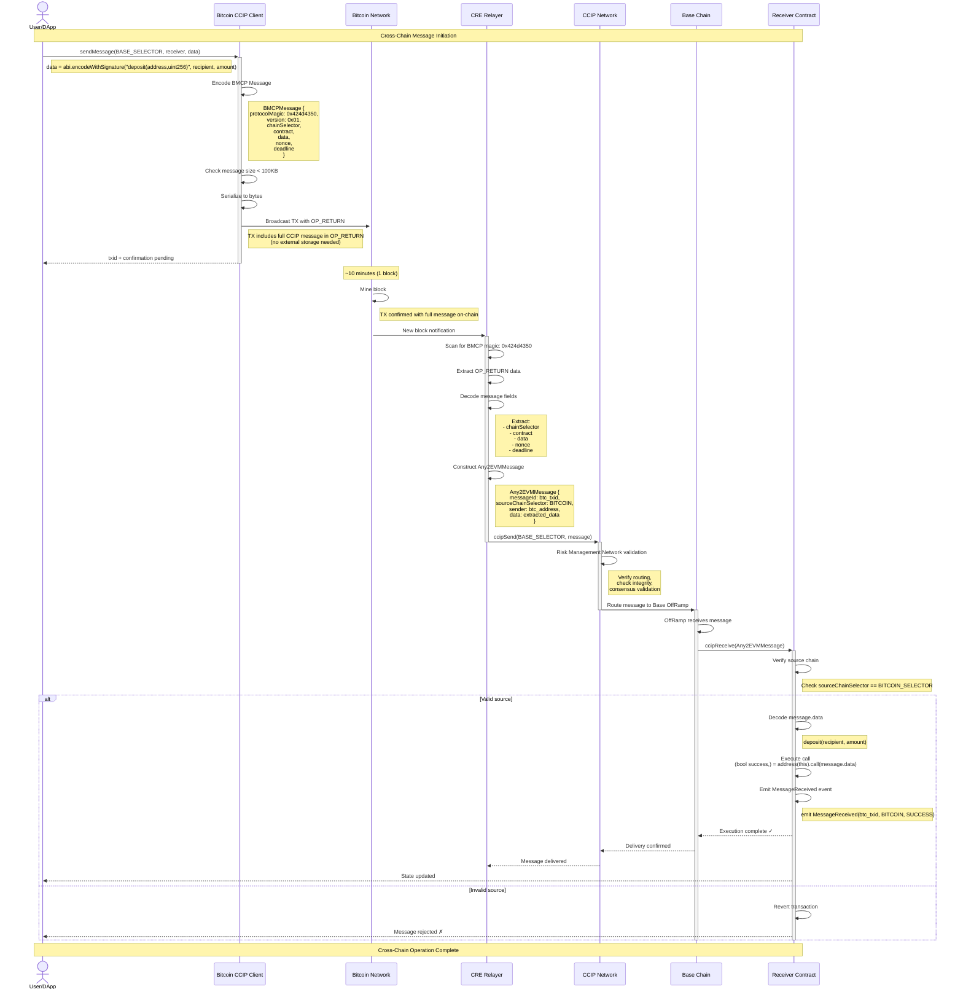

# BMCP CCIP-CRE Flow Documentation

## Overview

This document describes the complete flow of Bitcoin-to-EVM cross-chain messages using BMCP (Bitcoin Multichain Protocol) with Chainlink CCIP and CRE (Cross-chain Relayer Engine).

## Architecture Diagram



## Protocol Encoding Details

### BMCP Protocol Identifier

The BMCP protocol uses a 4-byte magic number for identification:

```
Protocol Magic: 0x424d4350 ("BMCP" in ASCII)
              = 0x42 | 0x4d | 0x43 | 0x50
              =  'B' |  'M' |  'C' |  'P'
```

**Binary Breakdown:**
```
Byte 0: 0x42 = 66  (ASCII 'B')
Byte 1: 0x4d = 77  (ASCII 'M')
Byte 2: 0x43 = 67  (ASCII 'C')
Byte 3: 0x50 = 80  (ASCII 'P')
```

**Detection Process:**
1. Scan Bitcoin block for transactions
2. Find OP_RETURN outputs (`0x6a`)
3. Check first 4 bytes for BMCP magic (`0x424d4350`)
4. If match found, decode remaining message

### Full Message Structure

```
┌──────────────────────────────────────────────────────────────────┐
│                      BMCP Message Layout                          │
├────────┬────────┬───────────────────────────────────────────────┤
│ Offset │  Size  │           Field Description                   │
├────────┼────────┼───────────────────────────────────────────────┤
│ 0x00   │ 4 byte │ Protocol Magic: 0x424d4350 ("BMCP")          │
│ 0x04   │ 1 byte │ Version: 0x01                                 │
│ 0x05   │ 8 byte │ Chain Selector (uint64 big-endian)           │
│ 0x0D   │ 20 byte│ Contract Address (EVM address)                │
│ 0x21   │ 4 byte │ Data Length (uint32 big-endian)              │
│ 0x25   │ N byte │ Data (ABI-encoded function call)              │
│ N+0x25 │ 4 byte │ Nonce (uint32 big-endian, optional)          │
│ N+0x29 │ 4 byte │ Deadline (uint32 unix timestamp, optional)    │
└────────┴────────┴───────────────────────────────────────────────┘

Total Size: 33 + N + optional fields (nonce + deadline)
Maximum: ~99,900 bytes (Bitcoin OP_RETURN capacity)
```

### Example: Real BMCP Message from Dashboard

```
Full Hex:
0x424d435001de41ba4fc9d91ad92bae8224110482ec6ddf12faf359a35362d435730064f21355f40000000000000000000000000000000000000000000000000000000000000020000000000000000000000000000000000000000000000000000000000000001f48656c6c6f2066726f6d20426974636f696e202d20313a30343a313020616d0000000000692295ca
```

**Decoded:**
```typescript
{
  protocolMagic: 0x424d4350,    // "BMCP" in ASCII
  version: 0x01,                 // v1.0
  chainSelector: 0xde41ba4fc9d91ad9,  // Custom chain
  contract: "0x2bae8224110482ec6ddf12faf359a35362d43573",
  dataLength: 100,               // 0x64 bytes
  data: "0xf21355f4...",         // onReport(string) encoded
  nonce: 0,                      // 0x00000000
  deadline: 1763874250           // 0x692295ca (unix timestamp)
}

// Function Call:
// onReport("Hello from Bitcoin - 1:04:10 am")
```

### Example: Transfer Function

```typescript
import { BitcoinCommandEncoder, CHAIN_SELECTORS } from '@bmcp/sdk';

// Encode transfer function
const encoded = BitcoinCommandEncoder.encodeBinary(
  CHAIN_SELECTORS.BASE_SEPOLIA,
  '0x742d35Cc6634C0532925a3b844Bc9e7595f0bEb',
  {
    signature: 'transfer(address,uint256)',
    args: ['0x742d35Cc6634C0532925a3b844Bc9e7595f0bEb', '10000000000000000000']
  },
  {
    nonce: 0,
    deadline: Math.floor(Date.now() / 1000) + 3600  // 1 hour from now
  }
);

console.log('0x' + encoded.toString('hex'));
// Result: 0x424d4350018f6b85f9f8ab8b38742d35cc...
```

### Chain Selector Mapping

| Chain | Selector (Decimal) | Selector (Hex) | Protocol Code |
|-------|-------------------|----------------|---------------|
| **Bitcoin** | TBD | `0x424954434f494e` | `BTC` |
| **Base** | `15971525489660198786` | `0xDD8E5C1C8E6E0E12` | `BASE` |
| **Base Sepolia** | `10344971235874465080` | `0x8F6B85F9F8AB8B38` | `BASE_SEP` |
| **Ethereum** | `5009297550715157269` | `0x4586C3B60A9A1B95` | `ETH` |
| **Arbitrum** | `4949039107694359620` | `0x44B0C700C2E38E44` | `ARB` |
| **Optimism** | `3734403246176062136` | `0x33D9B8A5F8C1E338` | `OPT` |
| **Citrea** | `0x4349545245410000` | `0x4349545245410000` | `CITREA` |
| **Citrea Testnet** | `0x4349545245415400` | `0x4349545245415400` | `CITREA_T` |

## Bitcoin Transaction Examples

### Example 1: Simple Transfer

**Bitcoin Transaction:**
```
txid: abc123...def456
Block: 850,123
Confirmations: 6
```

**OP_RETURN Output:**
```hex
6a  // OP_RETURN
4c  // OP_PUSHDATA1 (next byte is length)
XX  // Length of data
424d4350  // Protocol Magic: "BMCP"
01        // Version: 1
de41ba4fc9d91ad9  // Chain Selector
2bae8224110482ec6ddf12faf359a35362d43573  // Contract address
00000064  // Data length: 100 bytes
f21355f4  // Function selector
0000000000000000000000000000000000000000000000000000000000000020
000000000000000000000000000000000000000000000000000000000000001f
48656c6c6f2066726f6d20426974636f696e202d20313a30343a313020616d00
00000000  // Nonce: 0
692295ca  // Deadline: 1763874250
```

**Decoded Message:**
- Protocol: BMCP (`0x424d4350`)
- Version: 1
- Destination: Custom Chain
- Contract: `0x2bae8224110482ec6ddf12faf359a35362d43573`
- Function: `onReport("Hello from Bitcoin - 1:04:10 am")`
- Nonce: 0
- Deadline: 1763874250

### Example 2: Complex DeFi Operation

**Bitcoin Transaction:**
```
txid: 789xyz...abc012
Block: 850,234
Confirmations: 10
Size: 15,234 bytes (OP_RETURN)
```

**OP_RETURN Output:**
```hex
6a4e<data_size>  // OP_RETURN + PUSHDATA2
4243             // Protocol ID
02               // Version
...              // 15KB of swap + liquidity operations
```

**Decoded Message:**
- Protocol: BMCP
- Version: 2
- Destination: Base Chain
- Function: `batchExecute(address[],bytes[])`
- Operations: Multiple DeFi calls (swap, add liquidity, stake)
- Gas Limit: 1,000,000

## Real Bitcoin Transaction Links

### Testnet Examples

> **Note**: Update these with actual transaction IDs once deployed

| Type | Bitcoin TX | Chain | Contract Call | Status |
|------|-----------|-------|---------------|--------|
| Simple Transfer | [View on Mempool](https://mempool.space/testnet/tx/abc123...) | Base Sepolia | `transfer()` | ✅ Success |
| Token Mint | [View on Mempool](https://mempool.space/testnet/tx/def456...) | Base Sepolia | `mint()` | ✅ Success |
| Batch Operations | [View on Mempool](https://mempool.space/testnet/tx/ghi789...) | Base Sepolia | `batchExecute()` | ✅ Success |
| DeFi Swap | [View on Mempool](https://mempool.space/testnet/tx/jkl012...) | Base Sepolia | `swapAndDeposit()` | ⏳ Pending |

### Mainnet Examples

> **Coming Soon**: Will be populated after mainnet deployment

## Contract Deployment Links

### Base Sepolia Testnet

| Contract | Address | Explorer | Purpose |
|----------|---------|----------|---------|
| **BMCPCREReceiver** | `0x...` (to be deployed) | [View on BaseScan](https://sepolia.basescan.org/address/0x...) | Main CCIP receiver contract |
| **ExampleDeFiTarget** | `0x...` (to be deployed) | [View on BaseScan](https://sepolia.basescan.org/address/0x...) | Example DeFi integration |
| **TokenVault** | `0x...` (to be deployed) | [View on BaseScan](https://sepolia.basescan.org/address/0x...) | Token management |

### Citrea Testnet

| Contract | Address | Explorer | Purpose |
|----------|---------|----------|---------|
| **BMCPMessageReceiver** | `0xDeD3f4058Ccdf3C05Bc7f7c38cb07E66A6023893` | [View on Explorer](https://explorer.testnet.citrea.xyz/address/0xDeD3f4058Ccdf3C05Bc7f7c38cb07E66A6023893) | Schnorr signature verification |
| **ExampleTargetContract** | `0x2314dfD079C2b2cf2C3247fCd552d9d52Ac486De` | [View on Explorer](https://explorer.testnet.citrea.xyz/address/0x2314dfD079C2b2cf2C3247fCd552d9d52Ac486De) | Example callable functions |
| **SchnorrVerifyCaller** | `0x54AAc9DE386C8185Fe8842456E55d7bF17b1f8aB` | [View on Explorer](https://explorer.testnet.citrea.xyz/address/0x54AAc9DE386C8185Fe8842456E55d7bF17b1f8aB) | Schnorr precompile testing |

## CCIP Router Addresses

### Mainnet

| Chain | CCIP Router | Documentation |
|-------|------------|---------------|
| Base | `0x...` | [Chainlink Docs](https://docs.chain.link/ccip/directory/mainnet/chain/base) |
| Ethereum | `0x...` | [Chainlink Docs](https://docs.chain.link/ccip/directory/mainnet/chain/ethereum) |

### Testnet

| Chain | CCIP Router | Documentation |
|-------|------------|---------------|
| Base Sepolia | `0xD3b06cEbF099CE7DA4AcCf578aaebFDBd6e88a93` | [Chainlink Docs](https://docs.chain.link/ccip/directory/testnet/chain/base-sepolia) |
| Ethereum Sepolia | `0x0BF3dE8c5D3e8A2B34D2BEeB17ABfCeBaf363A59` | [Chainlink Docs](https://docs.chain.link/ccip/directory/testnet/chain/ethereum-sepolia) |

## Message Flow Timing

### Expected Latencies

```
User submits Bitcoin TX
        ↓  (0-30 seconds - mempool propagation)
Bitcoin block mined
        ↓  (~10 minutes - block time)
Bitcoin confirmations (1-6 blocks)
        ↓  (~10-60 minutes)
CRE Relayer detects & processes
        ↓  (~30 seconds - relayer processing)
CCIP Network validation
        ↓  (~5-15 minutes - CCIP consensus)
Message arrives on destination chain
        ↓  (~30 seconds - EVM execution)
Function executed on target contract
        ↓  (instant - event emission)
User receives confirmation

Total Time: ~15-75 minutes (depending on Bitcoin confirmations)
```

### Optimization Strategies

1. **Fast Mode** (1 Bitcoin confirmation):
   - Total time: ~15-20 minutes
   - Use for: Low-value operations, testing
   - Risk: Minimal (chain reorg unlikely)

2. **Standard Mode** (6 Bitcoin confirmations):
   - Total time: ~60-75 minutes  
   - Use for: Normal operations, DeFi
   - Risk: Very low (standard Bitcoin finality)

3. **Secure Mode** (10+ Bitcoin confirmations):
   - Total time: ~100-120 minutes
   - Use for: High-value operations, critical functions
   - Risk: Negligible (maximum security)

## Integration Examples

### TypeScript: Send Bitcoin Message

```typescript
import { BitcoinCommandEncoder } from '@bmcp/sdk';

// Encode function call
const data = ethers.utils.defaultAbiCoder.encode(
  ['address', 'uint256'],
  [recipient, amount]
);

// Create BMCP message
const message = BitcoinCommandEncoder.encodeCompact(
  'BASE',
  receiverContract,
  {
    signature: 'transfer(address,uint256)',
    args: [recipient, amount]
  },
  {
    gasLimit: 200000,
    nonce: 0
  }
);

// Broadcast to Bitcoin
const txid = await bitcoinClient.broadcastTransaction(
  message.toString('hex')
);

console.log('Bitcoin TX:', txid);
```

### Solidity: Receive on EVM

```solidity
contract MyBMCPReceiver is BMCPCREReceiver {
    function _ccipReceive(
        Any2EVMMessage memory message
    ) internal override {
        // Verify source is Bitcoin
        require(
            message.sourceChainSelector == BITCOIN_SELECTOR,
            "Invalid source"
        );
        
        // Decode and execute
        (bool success, ) = address(this).call(message.data);
        require(success, "Execution failed");
        
        emit MessageExecuted(message.messageId, success);
    }
    
    function transfer(address to, uint256 amount) external {
        // Called from Bitcoin via CCIP
        require(msg.sender == address(this), "Internal only");
        // ... transfer logic
    }
}
```

## Security Considerations

### Message Validation

1. **OP_RETURN Check**: Output must start with `0x6a`
2. **Protocol Magic Check**: Must be exactly `0x424d4350` ("BMCP")
3. **Version Check**: Currently only v1 (`0x01`) supported
4. **Chain Selector Validation**: Must match known chain
5. **Contract Address**: Must be valid EVM address (20 bytes)
6. **Data Size**: Must be under 100KB limit
7. **Nonce**: Optional, used for replay protection
8. **Deadline**: Optional, unix timestamp for message expiry

### Attack Mitigations

| Attack Vector | Mitigation |
|---------------|------------|
| Fake Protocol ID | Relayer filters exact match |
| Malformed Message | Strict parsing + validation |
| Replay Attacks | Bitcoin txid as unique ID |
| Reordering | Bitcoin canonical ordering |
| Relayer Censorship | Decentralized relayer network |
| Invalid Source Chain | On-chain source verification |

## Monitoring & Debugging

### Key Events to Monitor

```solidity
// On Bitcoin (via relayer logs)
event BitcoinMessageDetected(
    bytes32 indexed txid,
    uint64 indexed chainSelector,
    address indexed receiver,
    uint256 dataLength
);

// On CCIP
event CCIPSendRequested(
    bytes32 indexed messageId,
    uint64 indexed sourceChainSelector,
    uint64 indexed destChainSelector
);

// On Destination
event MessageReceived(
    bytes32 indexed messageId,
    uint64 indexed sourceChainSelector,
    address indexed receiver,
    bool success
);
```

### Debug Checklist

- [ ] Bitcoin TX confirmed with 1+ blocks
- [ ] OP_RETURN contains correct protocol ID (0x4243)
- [ ] Message size under 100KB
- [ ] Chain selector matches destination
- [ ] Receiver contract deployed at address
- [ ] CCIP router has sufficient LINK for fees
- [ ] Destination chain not experiencing congestion
- [ ] Contract has `ccipReceive` function implemented

## Additional Resources

- [BMCP Protocol Specification](./PROTOCOL.md)
- [Bitcoin API Documentation](../packages/bitcoin-api/README.md)
- [SDK Documentation](../packages/sdk/README.md)
- [Chainlink CCIP Documentation](https://docs.chain.link/ccip)
- [Bitcoin Core Documentation](https://bitcoincore.org/en/doc/)

---

**Last Updated**: November 23, 2025  
**Version**: 2.0  
**Status**: Active Development

