# BMCP Citrea Schnorr Verification Contracts

[](https://opensource.org/licenses/MIT)
[](https://soliditylang.org/)
[](https://book.getfoundry.sh/)

This repository contains smart contracts for **BMCP (Bitcoin Multichain Protocol)** that integrate Bitcoin OP_RETURN messages with Citrea's Schnorr signature verification precompiles.

## Overview

**Bitcoin → Citrea with Schnorr Verification**

These contracts enable trustless execution of function calls on Citrea triggered from Bitcoin transactions, with cryptographic proof via Schnorr signature verification:

1. **User** creates Bitcoin transaction with OP_RETURN payload
2. **Bitcoin** transaction is mined and confirmed
3. **Relayer** extracts message from OP_RETURN + signature from transaction input
4. **Citrea** verifies Schnorr signature using precompile
5. **Contract** executes authorized function call

## Contracts

### Deployment Screenshots

#### BMCPMessageReceiver Deployment


#### ExampleTargetContract Deployment


## Deployed Contracts on Citrea Testnet

### Network Information
- **Network**: Citrea Testnet
- **Chain ID**: 5115
- **RPC URL**: https://rpc.testnet.citrea.xyz
- **Explorer**: https://explorer.testnet.citrea.xyz

### Contract Addresses

| Contract | Address | Explorer Link |
|----------|---------|---------------|
| **BMCPMessageReceiver** | `0xDeD3f4058Ccdf3C05Bc7f7c38cb07E66A6023893` | [View on Explorer](https://explorer.testnet.citrea.xyz/address/0xDeD3f4058Ccdf3C05Bc7f7c38cb07E66A6023893) |
| **ExampleTargetContract** | `0x2314dfD079C2b2cf2C3247fCd552d9d52Ac486De` | [View on Explorer](https://explorer.testnet.citrea.xyz/address/0x2314dfD079C2b2cf2C3247fCd552d9d52Ac486De) |
| **SchnorrVerifyCaller** | `0x54AAc9DE386C8185Fe8842456E55d7bF17b1f8aB` | [View on Explorer](https://explorer.testnet.citrea.xyz/address/0x54AAc9DE386C8185Fe8842456E55d7bF17b1f8aB) |


### Deployment Transactions

#### ✅ ExampleTargetContract Deployment
- **Transaction Hash**: `0x9a8e0a9ee302a8e25c8b44a2dca9b5d428d90fea8365f2780bf31f44e7654ad9`
- **Status**: ✅ Success
- **Gas Used**: 929,460 gas
- **Block**: #18,498,362
- **Link**: [View Transaction](https://explorer.testnet.citrea.xyz/tx/0x9a8e0a9ee302a8e25c8b44a2dca9b5d428d90fea8365f2780bf31f44e7654ad9)

#### ✅ BMCPMessageReceiver Deployment
- **Transaction Hash**: `0x3e231e37f88236b2ab1a58ac483c1e9637662e1dba635d7691b477c40a1d05d7`
- **Status**: ✅ Success
- **Gas Used**: 947,465 gas
- **Block**: #18,498,362
- **Link**: [View Transaction](https://explorer.testnet.citrea.xyz/tx/0x3e231e37f88236b2ab1a58ac483c1e9637662e1dba635d7691b477c40a1d05d7)

#### ✅ Initial Token Mint
- **Transaction Hash**: `0x540f6e4ef556b80d9d1ce383ae8341158a0ec20c297f35efbf2bf617244bad20`
- **Status**: ✅ Success
- **Function**: `mint(address,uint256)`
- **Amount**: 1,000,000 tokens
- **Gas Used**: 46,234 gas
- **Link**: [View Transaction](https://explorer.testnet.citrea.xyz/tx/0x540f6e4ef556b80d9d1ce383ae8341158a0ec20c297f35efbf2bf617244bad20)


### BMCP Core Contracts

1. **BMCPMessageReceiver.sol** - Main receiver contract that:
   - Receives messages from BMCP relayer
   - Verifies Bitcoin Schnorr signatures using Citrea precompile
   - Validates authorization constraints (allowed contracts, functions, limits)
   - Executes authorized function calls
   - Implements replay protection via nonces

2. **ExampleTargetContract.sol** - Example contract demonstrating:
   - Message storage from Bitcoin
   - Token transfers
   - Data storage
   - Swap operations
   - Batch execution

3. **SchnorrVerifyCaller.sol** - Low-level Schnorr verification utilities:
   - Direct precompile testing
   - Signature verification with logging
   - Debug utilities for precompile responses

### Deployer Account
- **Address**: `0x2cac89ABf06DbE5d3a059517053B7144074e1CE5`
- **Total Gas Used**: ~0.000005 cBTC

## 🔄 BMCP Message Flow Sequence

```mermaid
sequenceDiagram
    participant User as Bitcoin User
    participant BTC as Bitcoin Network
    participant Relayer as BMCP Relayer
    participant Citrea as Citrea Network
    participant Precompile as Schnorr Precompile<br/>(0x0200)
    participant Receiver as BMCPMessageReceiver
    participant Target as Target Contract

    Note over User,Target: 1. Message Creation & Signing
    User->>User: Create BMCP message<br/>{target, function, data, nonce}
    User->>User: Sign message hash<br/>with Bitcoin private key
    User->>User: Compute Schnorr signature<br/>(64 bytes)

    Note over User,Target: 2. Bitcoin Transaction
    User->>BTC: Create transaction<br/>- Input: Schnorr signature in witness<br/>- Output: OP_RETURN with message
    BTC->>BTC: Mine transaction<br/>Confirm in block
    BTC-->>User: Transaction confirmed<br/>txid: 0x123...

    Note over User,Target: 3. Relayer Detection
    Relayer->>BTC: Monitor Bitcoin blocks<br/>for OP_RETURN messages
    BTC-->>Relayer: New BMCP message detected<br/>Extract from OP_RETURN
    Relayer->>Relayer: Extract signature<br/>from tx.inputs[0].witness[0]
    Relayer->>Relayer: Extract pubkey<br/>from tx.inputs[0].witness[1]

    Note over User,Target: 4. Message Relay to Citrea
    Relayer->>Receiver: receiveMessage(txid, message, proof)<br/>proof = {pubKeyX, signature}
    
    Note over User,Target: 5. Validation Checks
    Receiver->>Receiver: Check message not processed
    Receiver->>Receiver: Check deadline not expired
    Receiver->>Receiver: Check authorization expiry

    Note over User,Target: 6. Schnorr Signature Verification
    Receiver->>Receiver: Compute message hash<br/>hash = keccak256(protocol, chain, target, data, nonce, deadline)
    Receiver->>Precompile: staticcall(0x0200)<br/>input = pubKeyX ‖ messageHash ‖ signature
    Precompile->>Precompile: Verify BIP340 Schnorr<br/>secp256k1 signature
    Precompile-->>Receiver: Return 32 bytes<br/>last byte = 0x01 (valid)
    
    alt Signature Invalid
        Receiver-->>Relayer: Emit AuthorizationViolation<br/>"Invalid Schnorr signature"
        Receiver-->>Relayer: Return false
    end

    Note over User,Target: 7. Authorization Checks
    Receiver->>Receiver: Verify allowedContract<br/>matches target contract
    Receiver->>Receiver: Verify allowedFunction<br/>matches function selector
    Receiver->>Receiver: Verify maxValue<br/>not exceeded
    
    alt Authorization Failed
        Receiver-->>Relayer: Emit AuthorizationViolation<br/>"Unauthorized contract/function"
        Receiver-->>Relayer: Return false
    end

    Note over User,Target: 8. Nonce Validation
    Receiver->>Receiver: Check nonce == expected<br/>for this pubKeyX
    Receiver->>Receiver: Increment nonce<br/>bitcoinNonces[pubKeyX]++
    
    alt Nonce Invalid
        Receiver-->>Relayer: Revert "Invalid nonce"
    end

    Note over User,Target: 9. Mark as Processed
    Receiver->>Receiver: Set processedMessages[txid] = true

    Note over User,Target: 10. Execute Function Call
    Receiver->>Target: call(message.data)<br/>Execute function with calldata
    Target->>Target: Execute function logic<br/>(storeMessage, transfer, etc.)
    Target-->>Receiver: Return success + returnData
    
    Receiver->>Receiver: Emit FunctionExecuted<br/>(txid, target, selector, success, returnData)
    Receiver-->>Relayer: Return true

    Note over User,Target: 11. Confirmation
    Relayer-->>User: Message executed successfully<br/>Function call result available
```



## 🚀 Features

### BMCP Integration

- **Schnorr Signature Verification**: Verifies signatures from Bitcoin transaction inputs using BIP340
- **Authorization System**: Granular control over which contracts and functions can be called
- **Replay Protection**: Nonce-based protection against replay attacks
- **Deadline Enforcement**: Messages expire after deadline
- **Value Limits**: Maximum value constraints for function calls
- **Trustless Execution**: No trust in relayer required (signature verified on-chain)

### Message Structure

```solidity
struct BMCPMessage {
    bytes2 protocol;             // 0x4243 ("BC")
    uint64 chainSelector;        // Citrea chain ID (5115)
    address targetContract;      // Contract to call
    bytes data;                  // Function calldata
    uint256 nonce;               // Replay protection
    uint256 deadline;            // Message expiry timestamp
    Authorization authorization; // Constraints
}

struct Authorization {
    address allowedContract;     // Which contract (0x0 = any)
    bytes4 allowedFunction;      // Which function (0x00000000 = any)
    uint256 maxValue;            // Max value in wei
    uint256 validUntil;          // Auth expiry timestamp
}

struct SchnorrProof {
    bytes32 pubKeyX;             // Bitcoin public key X coordinate
    bytes signature;             // 64-byte Schnorr signature (r || s)
}
```

## 📋 Prerequisites

- [Foundry](https://book.getfoundry.sh/getting-started/installation)
- Node.js v18+ (for integration)
- Git

## 🛠️ Setup

1. Navigate to contracts directory:

```bash
cd packages/zkevm-schnorr-contracts
```

2. Install dependencies:

```bash
forge install
```

3. Copy environment file:

```bash
cp env.example .env
```

4. Configure `.env`:

```bash
# Add your private key (without 0x prefix)
PRIVATE_KEY=your_private_key_here

# Add RPC URLs
CITREA_TESTNET_RPC_URL=https://rpc.testnet.citrea.xyz
```

## 🏗️ Building

Compile contracts:

```bash
forge build
```

## 🧪 Testing

Run tests:

```bash
forge test
```

Run with gas reporting:

```bash
forge test --gas-report
```

Run with verbose output:

```bash
forge test -vvv
```

Run specific test:

```bash
forge test --match-test testReceiveMessage -vvv
```

## 🚢 Deployment

### Citrea Testnet

Deploy BMCP contracts:

```bash
forge script script/DeployBMCP.s.sol --rpc-url citrea_testnet --broadcast --verify
```

Or use the deployment script:

```bash
./deploy-citrea.sh
```

### Local Development (Anvil)

1. Start Anvil:

```bash
anvil
```

2. Deploy contracts:

```bash
forge script script/DeployBMCP.s.sol --rpc-url http://localhost:8545 --broadcast
```

## 🎯 Usage Example

### 1. Create Message on Bitcoin (TypeScript)

```typescript
import { BitcoinCommandEncoder, BitcoinFunctionEncoder } from '@bmcp/sdk';

// Create function call for transfer
const transferCall = BitcoinFunctionEncoder.custom(
  'transfer(address,uint256)',
  ['0xRecipient', '1000000']
);

// Encode BMCP message with authorization
const payload = BitcoinCommandEncoder.encodeJSON(
  'CITREA_TESTNET',
  '0x2314dfD079C2b2cf2C3247fCd552d9d52Ac486De', // ExampleTargetContract
  transferCall,
  {
    nonce: 0,
    deadline: Math.floor(Date.now() / 1000) + 3600, // 1 hour from now
    authorization: {
      allowedContract: '0x2314dfD079C2b2cf2C3247fCd552d9d52Ac486De',
      allowedFunction: '0xa9059cbb',  // transfer function selector
      maxValue: '1000000',
      validUntil: Math.floor(Date.now() / 1000) + 86400 // 24 hours
    }
  }
);

// Post to Bitcoin (payload goes in OP_RETURN)
// Sign transaction with Bitcoin private key to create Schnorr signature
```

### 2. Bitcoin Transaction Structure

```
Transaction {
  inputs: [
    {
      witness: [
        signature,  // ← Schnorr signature (64 bytes) - r || s
        pubkey      // ← Public key (33 bytes compressed)
      ]
    }
  ],
  outputs: [
    {
      value: 0,
      scriptPubKey: OP_RETURN <BMCP_MESSAGE_PAYLOAD>
    }
  ]
}
```

### 3. Relayer Forwards to Citrea

```typescript
// Relayer extracts from Bitcoin transaction
const message = extractOpReturnMessage(tx);
const signature = tx.inputs[0].witness[0]; // 64 bytes
const pubkey = tx.inputs[0].witness[1];    // 33 bytes

// Extract X coordinate from compressed pubkey (skip first byte)
const pubKeyX = pubkey.slice(1); // 32 bytes

// Forward to Citrea BMCPMessageReceiver
await receiverContract.receiveMessage(
  tx.txid,
  message,
  { pubKeyX: pubKeyX, signature: signature }
);
```

### 4. Citrea Verifies and Executes

```solidity
// BMCPMessageReceiver automatically:
// 1. Verifies Schnorr signature using precompile (0x0200)
// 2. Checks authorization constraints
// 3. Validates nonce for replay protection
// 4. Marks message as processed
// 5. Executes function call on target contract
// 6. Emits events for tracking
```

## 🔐 Security Features

1. **Cryptographic Verification**: Schnorr signatures (BIP340) verified using Citrea precompile
2. **Authorization Constraints**: Only whitelisted contracts and functions can be called
3. **Replay Protection**: Per-pubkey nonce tracking prevents duplicate executions
4. **Deadline Enforcement**: Messages expire after deadline timestamp
5. **Value Limits**: Maximum value constraints prevent excessive transfers
6. **Relayer Independence**: No trust in relayer (signature verified on-chain)
7. **Event Logging**: All operations emit events for transparency

## 📊 Architecture Diagram

```
┌─────────────────────────────────────────────────────────────────┐
│                         Bitcoin Layer                            │
│  ┌──────────────┐         ┌─────────────────┐                  │
│  │ Bitcoin User │────────▶│ Bitcoin Network │                  │
│  │ (Signs msg)  │         │  OP_RETURN tx   │                  │
│  └──────────────┘         └────────┬────────┘                  │
└────────────────────────────────────┼──────────────────────────┘
                                      │
                                      ▼
┌─────────────────────────────────────────────────────────────────┐
│                      Relayer Infrastructure                      │
│  ┌────────────────────────────────────────────────────────┐    │
│  │ BMCP Relayer                                            │    │
│  │ • Monitors Bitcoin blocks                               │    │
│  │ • Extracts OP_RETURN messages                           │    │
│  │ • Extracts Schnorr signatures from witness              │    │
│  │ • Submits to Citrea                                     │    │
│  └─────────────────────────┬──────────────────────────────┘    │
└────────────────────────────┼─────────────────────────────────┘
                             │
                             ▼
┌─────────────────────────────────────────────────────────────────┐
│                         Citrea Layer                             │
│                                                                  │
│  ┌────────────────────┐      ┌──────────────────────────┐      │
│  │ Schnorr Precompile │◀─────│ BMCPMessageReceiver      │      │
│  │   (0x0200)         │      │ • Verify signature       │      │
│  │ • BIP340 verify    │      │ • Check authorization    │      │
│  │ • secp256k1        │      │ • Validate nonce         │      │
│  └────────────────────┘      │ • Execute call           │      │
│                              └──────────┬───────────────┘      │
│                                         │                       │
│                                         ▼                       │
│                              ┌──────────────────────────┐      │
│                              │ Target Contract          │      │
│                              │ • ExampleTargetContract  │      │
│                              │ • Custom DeFi contracts  │      │
│                              │ • Any authorized contract│      │
│                              └──────────────────────────┘      │
└─────────────────────────────────────────────────────────────────┘
```

## 🔍 Precompile Information

### Schnorr Precompile (BIP340)
- **Address**: `0x0000000000000000000000000000000000000200`
- **Standard**: BIP340 (Schnorr signatures for secp256k1)
- **Input Format**: `pubKeyX (32 bytes) || messageHash (32 bytes) || signature (64 bytes)`
- **Output Format**: `32 bytes` (last byte = 0x01 for valid signature)
- **Status**: ⚠️ Currently not available on Citrea Testnet (coming soon)

### Test Vectors
```json
{
  "privateKey": "0xc2a41c2e0c627eb2592de3ecc67e74fcaf4d6eb6dac2bd624cae52f0f3bd0924",
  "pubKeyX": "0xf9308a019258c31049344f85f89d5229b531c845836f99b08601f113bce036f9",
  "message": "0x526cd5290598c2ec7265d398dac30db8aaa2d615d83704daa2d5628fbd770132",
  "signature": "0xebdee97d060096cfc868ccfa97b6f61c8837ac0e3396abb31d45e68679654a14a7c08cd54f772890989d0fee7d77add7f79288f34d37205b383b8d4246034d9d"
}
```

## 🧩 Integration with BMCP Stack

This contract package integrates with:

1. **@bmcp/sdk** - Message encoding/decoding and Bitcoin utilities
2. **@bmcp/bitcoin-api** - Bitcoin transaction creation and signing
3. **@bmcp/relayer-api** - Message relay from Bitcoin to Citrea
4. **@bmcp/client** - Client library for end-to-end message flow

## 📚 Additional Resources

### Scripts Available

- `deploy-citrea.sh` - Deploy to Citrea testnet
- `test-receive-message.sh` - Test message receiving flow
- `verify-contracts.sh` - Verify contracts on block explorer
- `prepare-sourcify-files.sh` - Prepare files for Sourcify verification

### Documentation

- [Citrea Documentation](https://docs.citrea.xyz)
- [BIP340 - Schnorr Signatures](https://github.com/bitcoin/bips/blob/master/bip-0340.mediawiki)
- [Foundry Book](https://book.getfoundry.sh/)

## 🤝 Contributing

Contributions welcome! Please:

1. Fork the repository
2. Create a feature branch
3. Make your changes
4. Add tests
5. Submit a pull request

## 📝 License

MIT License - see [LICENSE](LICENSE) for details.

## 🔗 Related Projects

- [BMCP Core Repository](../../) - Main BMCP protocol implementation
- [Citrea](https://citrea.xyz) - Bitcoin-secured ZK rollup
- [Bitcoin](https://bitcoin.org) - The Bitcoin network

## 📧 Contact & Support

For questions, issues, or contributions:
- GitHub Issues: [Report issues](https://github.com/your-org/BMCP/issues)
- Documentation: [BMCP Docs](https://docs.bmcp.xyz)

---

**Built with ❤️ for the Bitcoin ecosystem**
